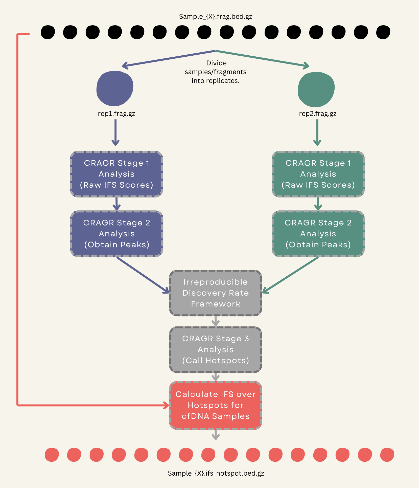

#  ‎ ‎ ‎CRAGR_v2
CRAGR_v2 (**C**ell f**R**ee dn**A** fra**G**mentation) is a pipeline for [CRAGR](https://github.com/epifluidlab/cragr) that incorporates Irreproducible Discovery Rate (IDR) to hotspot calling enable consistency between replicates or sets of samples.

## Table of Contents

- [1. Installation](#installation)
- [2. Quick Start](#quick-start)
- [3. Parameters](#parameters)
- [4. Workflow Diagram](#workflow-diagram)
- [5. Citation](#citation)
- [6. Contact](#contact)
- [7. License](#license)

## Installation

1. Create and activate a `conda` environment with a Python version greater than 3.8 and an R version greater than 4.1.

```bash
conda create --name CRAGR python=3.11 r-base>=4.1
conda activate CRAGR
```

2. Ensure that you have the proper dependencies (`tabix`, `bgzip`, `samtools`, `bedtools`, `idr`) installed.
```bash

```

## Quick Start

## Parameters

## Workflow Diagram

<p align="center">
  
</p>

## Citation
Zhou X, Zheng H, Fu H, McKillip KL, Pinney SM, Liu Y. (2022) CRAG: De novo characterization of cell-free DNA fragmentation hotspots in plasma whole-genome sequencing. Genome Medicine [](https://doi.org/10.1101/2020.07.16.201350)

## Contact

- Ravi Bandaru: ravi.bandaru@northwestern.edu
- Kundan Baliga: kudosbeluga@gmail.com
- Yaping Liu: yaping@northwestern.edu

## License
This project falls under an MIT license. See the included `LICENSE` file for details.